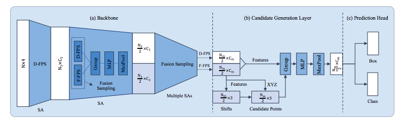
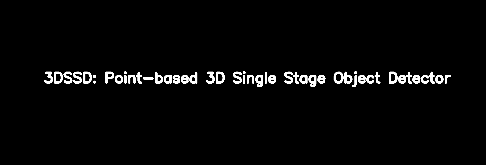

# 3DSSD 

## Point-based 3D Single Stage Object Detector (CVPR 2020 Oral)

This is the official implementation of [3DSSD: Point-based 3D Single Stage Object Detector](https://arxiv.org/abs/2002.10187)&nbsp; (CVPR 2020 Oral), a single-stage 3D point-based object detector.


### Introduction

Currently, there have been many kinds of voxel-based 3D single stage detectors, while point-based single stage methods are still underexplored. In this paper, we first present a lightweight and effective point-based 3D single stage object detector, named 3DSSD, achieving a good balance between accuracy and efficiency. In this paradigm, all upsampling layers and refinement stage, which are indispensable in all existing point-based methods, are abandoned to reduce the large computation cost. We novelly propose a fusion sampling strategy in downsampling process to make detection on less representative points feasible. A delicate box prediction network including a candidate generation layer, an anchor-free regression head with a 3D center-ness assignment strategy is designed to meet with our demand of accuracy and speed. Our paradigm is an elegant single stage anchor-free framework, showing great superiority to other existing methods. We evaluate 3DSSD on widely used KITTI dataset and more challenging nuScenes dataset. Our method outperforms all state-of-the-art voxel-based single stage methods by a large margin, and has comparable performance to two stage point-based methods as well, with inference speed more than 25 FPS, 2x faster than former state-of-the-art point-based methods.

### Overall Pipeline


<div align="center">
 
 <p><font size="2">3DSSD consists of three components. (a) Backbone network. It takes the raw point cloud as input, and generates global features for all representative points through several SA layers with fusion sampling (FS) strategy. (b) Candidate generation layer (CG). It downsamples, shifts and extracts features for representative points after SA layers. (c) Anchor-free prediction head.</font></p>
</div>

### Comparison between F-FPS and D-FPS

<p align="center"> </p>

### Requirements
All the codes are tested in the following environment:
* Ubuntu 16.04
* Python 3.6
* tensorflow 1.4.0
* CUDA 9.0 & CuDNN 7.0.0

### Performance and Model Zoo

Some pretrained models including 3DSSD and PointRCNN are listed below with their performance, which are trained on 3,717 training samples and evaluated on 3,769 testing samples.

<table>
    <thead>
        <tr>
            <th>Methods</th>
            <th>Easy AP</th>
            <th>Moderate AP</th>
            <th>Hard AP</th>
            <th>Models</th>
        </tr>
    </thead>
    <tbody>
        <tr>
            <td>3DSSD</td>
            <td>91.71</td>
            <td>83.30</td>
            <td>80.44</td>
            <td><a href="https://drive.google.com/file/d/1gl_ESp2R7pE_eJS8UbaL-Xn1uFUNg1Ha/view?usp=sharing"> model </a></td>
        </tr>
        <tr>
            <td>PointRCNN</td>
            <td>88.91</td>
            <td>79.88</td>
            <td>78.37</td>
            <td><a href="https://drive.google.com/file/d/1WBjlgsCzMl4-Yw_iuyQ9tYDX5FWOFi-m/view?usp=sharing"> model </a></td>
        </tr>
    </tbody>
</table>


### Installation

(1) Clone this repository.
```
git clone https://github.com/tomztyang/3DSSD
cd 3DSSD
```

(2) Setup Python environment.
```
conda create -n 3dssd python=3.6
source activate 3dssd
pip install -r requirements.txt
```

Download and install tensorflow-1.4.0 [here](https://drive.google.com/file/d/142fwmiq8skVUcEqxXny9zA4bNG7YULGn/view?usp=sharing) which is compiled with CUDA-9.0 and CuDNN-7.0.0.
```
pip install tensorflow-1.4.0-cp36-cp36m-linux_x86_64.whl
```

(3) Compile and install 3DSSD library. Note that only GCC no later than version 5.0 can compile CUDA-9.0 code, make sure you install gcc-5. 
```
bash compile_all.sh /path/to/tensorflow /path/to/cuda
```

(4) Add **3DSSD/lib** to PYTHONPATH.

```
export PYTHONPATH=$PYTHONPATH:/path/to/3DSSD/lib:/path/to/3DSSD/mayavi
```

### Data Preparation

Currently we only support KITTI dataset, and NuScenes dataset will be supported as soon as possible. 

(1) Please download the KITTI dataset and arrange it as below (please also download road planes at [here](https://drive.google.com/file/d/1d5mq0RXRnvHPVeKx6Q612z0YRO1t2wAp/view), which are useful in data augmentation).

```
.                                           (root directory)
|-- lib                                     (3DSSD library file)
|-- configs                                 (model configurations folder)
|-- ...
|-- dataset
    |-- KITTI                               (dataset directory)
    |   |-- object
    |       |-- train.txt                   (KITTI train images list (3712 samples))                              
    |       |-- val.txt                     (KITTI val images list (3769 samples))
    |       |-- test.txt                    (KITTI test images list (7518 samples))
    |       |-- trainval.txt                (KITTI images list (7481 samples))
    |       |-- training
    |       |   |-- calib
    |       |   |-- image_2
    |       |   |-- label_2
    |       |   |-- planes
    |       |   |-- velodyne
    |       |-- testing
    |-- NuScenes
    |   |-- ...
    |-- ...
```

(2) Choose the target configure file in **configs** directory (i.e., configs/kitti/3dssd/3dssd.yaml) and preprocess original dataset by


```
python lib/core/data_preprocessor.py --cfg configs/kitti/3dssd/3dssd.yaml --split training --img_list train

python lib/core/data_preprocessor.py --cfg configs/kitti/3dssd/3dssd.yaml --split training --img_list val

python lib/core/data_preprocessor.py --cfg configs/kitti/3dssd/3dssd.yaml --split testing --img_list test
```

The preprocessed data will be saved in directory **data/KITTI**. You can also modify the dataset path and saving path in configure file:

```
DATASET:
  TYPE: 'DATASET_NAME'           
  ...
  KITTI:
    CLS_LIST: ('Car', )
    ...
    BASE_DIR_PATH: 'PATH/TO/DATASET'
    TRAIN_LIST: 'PATH/TO/DATASET/train.txt'
    VAL_LIST: 'PATH/TO/DATASET/val.txt'
    ...
    SAVE_NUMPY_PATH: 'PATH/TO/SAVE_PATH'
```


### Training a model

To train a model with multiple GPU, you have to set the available GPU number and batch size for each GPU in configure files.

```
TRAIN:          
  ...
  CONFIG:
    # totally 8 batch
    BATCH_SIZE: 4
    GPU_NUM: 2
    ...
```

Then run


```
python lib/core/trainer.py --cfg configs/kitti/3dssd/3dssd.yaml
```

The trained models, configuration and logs will be saved in the **log** folder, which can also be assigned in configure files.

To load a pretrained model, you can use **--restore_model_path**.
```
python lib/core/trainer.py --cfg configs/kitti/3dssd/3dssd.yaml --restore_model_path /path/to/model
```


### Inference and Evaluation

Evaluating a trained weight by
```
python lib/core/evaluator.py --cfg configs/kitti/3dssd/3dssd.yaml --restore_model_path /path/to/weight
```

To evaluate all weights produced in the training process, run

```
python lib/core/evaluator.py --cfg configs/kitti/3dssd/3dssd.yaml --restore_model_path /path/to/weight_dir
```

KITTI Detection results and evaluation results will be saved in the **result** folder. 

In order to test a model and store its prediction results, run

```
python lib/core/tester.py --cfg configs/kitti/3dssd/3dssd.yaml --restore_model_path /path/to/weight
```
These results will be saved at **/path/to/weight/kitti_result**.


### TODO List
- [x] Multiple GPUs for training
- [x] Reduce training GPU memory usage
- [x] Support PointRCNN (CVPR2019) 
- [ ] Visualization tools
- [ ] Support STD (ICCV2019)
- [ ] Add NuScenes dataset 
- [ ] Still in progress


### Citations
If you find our work useful in your research, please consider citing:
```
@article{Yang2020ssd,
  author    = {Yang, Zetong and Sun, Yanan and Liu, Shu and Jia, Jiaya}
  title     = {3DSSD: Point-based 3D Single Stage Object Detector},
  journal   = {Proceedings of the IEEE Conference on Computer Vision and Pattern Recognition},
  year      = {2020},
}
```
 
and / or

```
@inproceedings{Yang2019std,
  author    = {Yang, Zetong and Sun, Yanan and Liu, Shu and Shen, Xiaoyong and Jia, Jiaya}
  title     = {{STD:} Sparse-to-Dense 3D Object Detector for Point Cloud},
  booktitle = {2019 {IEEE/CVF} International Conference on Computer Vision, {ICCV}
               2019, Seoul, Korea (South), October 27 - November 2, 2019},
  year      = {2019},
}
```

### Acknowledgment
This repo borrows code from several repos, like [second.pytorch](https://github.com/traveller59/second.pytorch) and [F-PointNet](https://github.com/charlesq34/frustum-pointnets).


### Contact
If you have any questions or suggestions about this repo, please feel free to contact me (tomztyang@gmail.com).


